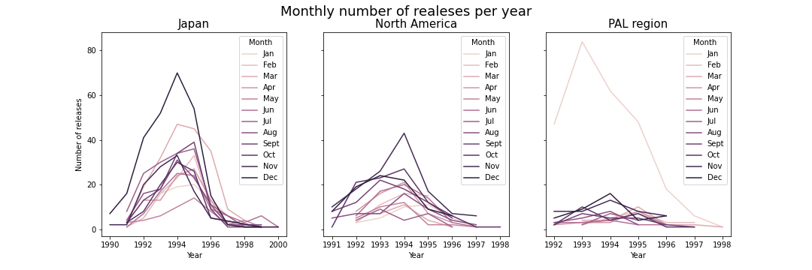
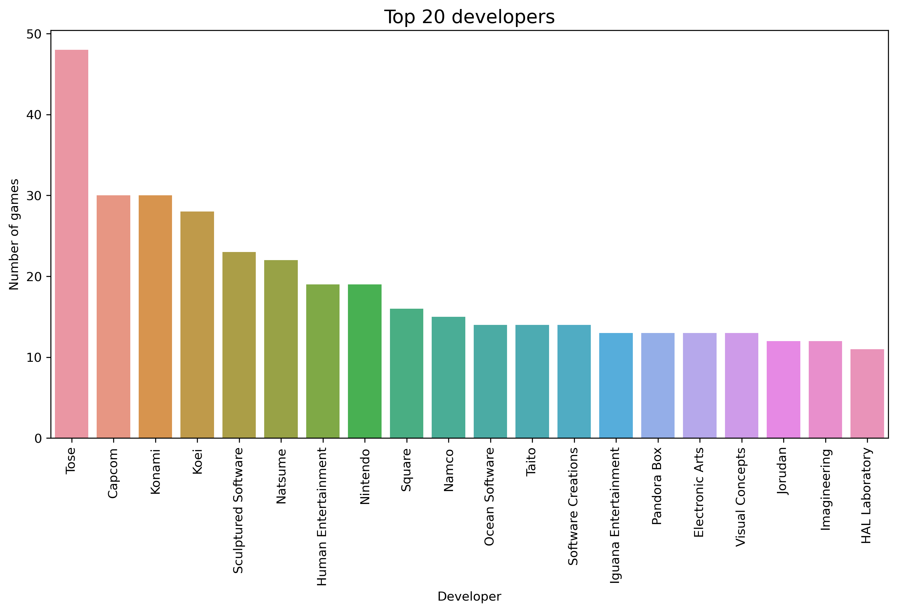
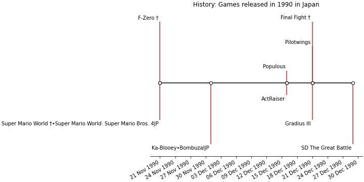

# Super Nintendo Analysis

## Project Overview
- Scraping the data from **[Wikipedia page](https://en.wikipedia.org/wiki/List_of_Super_Nintendo_Entertainment_System_games)** of all Super Nintendo Entertainment System (SNES) games.
- The dataset contains a list of 1757 official releases games, which contains title games, developer(s), publisher(s) and the release date for different regions (Japan, North America and PAL).
- The Python libraries used in this project was MechanicalSoup for web scraping and for analysis were Pandas, Numpy, Matplotlib and Seaborn. Access the Jupyter Notebook **[here](https://github.com/ThiPauli/super_nintendo_analysis/blob/main/Super%20Nintendo%20Games%20Dataset.ipynb)**.

## Objectives
* Extracting a huge table of data from the internet and store it inside a JSON file.
* Exploring the number of releases games per month and year by region.
* Evaluating how many games were developed by each company.
* Visualizing the history of releasing games, in this case in Japan for the 1990 year.

## Exploratory Data Analysis and Data Cleaning
### Data Cleaning
* Checking columns with missing values.
* Drop NaN values from DataFrame.
* Convert column as object to datetime.

### Exploratory Data Analysis
* Adding new columns as well as extracting months and hours from the order date.
* Using groupby to perform aggregate analysis.

## Data analysis and visualizations
* Monthly plot of the number of games relesed per year.

* Evaluating the top game developers by the amount of games released.

* Plotting the history of releasing games in Japan for the 1990 year.

## Conclusions
* The first game released in Japan was in November 1990 and the last one was in November 2000.
* Japan released more games.
* The peak of releasing was in 1994 for both Japan and North America.
* The PAL region is not precise because the release data only contain the year in many cases, so when converting the data for month, they automatically become the first month (January). Therefore, the PAL region graph shows peaks of releasing games in every years of January.
* Incredibly, Nintendo itself is not the most developer of SNES games.
* The classics Super Mario World and F-zero were the first games released in Super Nintendo history.
